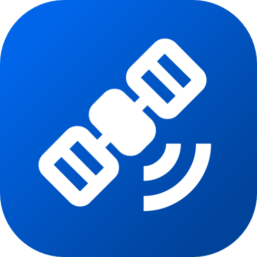

# InfiniTrack

Ein System zur Positionsverfolgung mit GPS und LoRa! Entstanden im Rahmen der Studienarbeit an der DHBW Karlsruhe.

## Applikation starten (Release Version)

Um die Applikation zu nutzen, kannst du dir den neusten Release herunterladen und diesen über die Kommandozeile mit
`java -jar infinitrack-<version>.jar` ausführen. Das Webinterface ist unter http://localhost:8080 in deinem Browser erreichbar.

## Applikation starten (Source Code)

Das Projekt ist ein Standard Maven-Projekt. Um dies über die Kommandozeile auszuführen, 
schreibe `mvnw` (Windows), oder `./mvnw` (Mac & Linux) und öffne http://localhost:8080 in deinem Browser.

Du kannst das Projekt außderdem auch einfach in eine IDE deiner Wahl importieren. Mehr findest du hier: [how to import Vaadin projects to different 
IDEs](https://vaadin.com/docs/latest/guide/step-by-step/importing) (Eclipse, IntelliJ IDEA, NetBeans, and VS Code).
